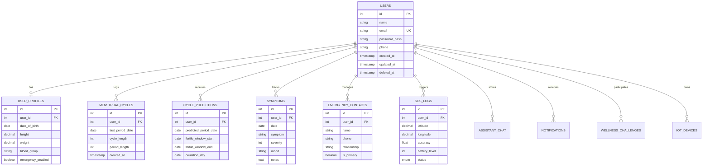

# REST API Documentation - Women Safety & Menstrual Health Backend

This document details the REST API specifications, authentication mechanisms, database ER diagram, sample requests, and architectural concepts.

Interactive Swagger documentation is available at:
`http://localhost:5000/api/docs`

Health check endpoint:
`http://localhost:5000/health`

---

## 1. Architecture Flow & Database ER Diagram

### System Architecture Flow
`HTTP Client (Expo App) -> Middleware (Auth, Validation, RateLimit) -> Routes -> Controllers -> Services -> MySQL Database`

### Database ER Diagram (Mermaid)



---

## 2. Standardized API Response Format

### Success Response
```json
{
  "success": true,
  "message": "Operation completed successfully.",
  "data": {}
}
```

### Error Response
```json
{
  "success": false,
  "message": "Validation failed",
  "errors": [
    {
      "field": "email",
      "message": "Please provide a valid email address."
    }
  ]
}
```

---

## 3. API Endpoints Reference

### Authentication (`/api/v1/auth`)

#### `POST /api/v1/auth/register`
**Request Body**:
```json
{
  "name": "Jane Doe",
  "email": "jane@example.com",
  "password": "Password123!",
  "phone": "+1234567890"
}
```
**Response (201 Created)**:
```json
{
  "success": true,
  "message": "Registration successful.",
  "data": {
    "user": {
      "id": 1,
      "name": "Jane Doe",
      "email": "jane@example.com",
      "phone": "+1234567890"
    },
    "token": "eyJhbGciOiJIUzI1NiIsIn..."
  }
}
```

#### `POST /api/v1/auth/login`
**Request Body**:
```json
{
  "email": "jane@example.com",
  "password": "Password123!"
}
```
**Response (200 OK)**:
```json
{
  "success": true,
  "message": "Login successful.",
  "data": {
    "user": {
      "id": 1,
      "name": "Jane Doe",
      "email": "jane@example.com"
    },
    "token": "eyJhbGciOiJIUzI1NiIsIn..."
  }
}
```

---

### User Profile (`/api/v1/users`)

#### `GET /api/v1/users/me`
**Headers**: `Authorization: Bearer <TOKEN>`
**Response (200 OK)**:
```json
{
  "success": true,
  "message": "User details retrieved.",
  "data": {
    "id": 1,
    "name": "Jane Doe",
    "email": "jane@example.com",
    "phone": "+1234567890",
    "profile": {
      "date_of_birth": "1998-05-15",
      "height": 165.5,
      "weight": 58.0,
      "blood_group": "O+",
      "emergency_enabled": true
    }
  }
}
```

---

### Menstrual Cycles (`/api/v1/menstrual`)

#### `POST /api/v1/menstrual`
**Request Body**:
```json
{
  "last_period_date": "2026-07-01",
  "cycle_length": 28,
  "period_length": 5
}
```
**Response (201 Created)**:
```json
{
  "success": true,
  "message": "Resource created successfully.",
  "data": {
    "id": 1,
    "user_id": 1,
    "last_period_date": "2026-07-01",
    "cycle_length": 28,
    "period_length": 5,
    "prediction": {
      "predicted_period_date": "2026-07-29",
      "fertile_window_start": "2026-07-10",
      "fertile_window_end": "2026-07-16",
      "ovulation_day": "2026-07-15"
    }
  }
}
```

---

### Emergency Contacts (`/api/v1/emergency`)

#### `POST /api/v1/emergency`
**Request Body**:
```json
{
  "name": "Sarah Mom",
  "phone": "+19876543210",
  "relationship": "Mother",
  "is_primary": true
}
```
**Response (201 Created)**:
```json
{
  "success": true,
  "message": "Resource created successfully.",
  "data": {
    "id": 1,
    "user_id": 1,
    "name": "Sarah Mom",
    "phone": "+19876543210",
    "relationship": "Mother",
    "is_primary": true
  }
}
```

---

### SOS Alerts (`/api/v1/sos`)

#### `POST /api/v1/sos`
**Request Body**:
```json
{
  "latitude": 37.7749,
  "longitude": -122.4194,
  "accuracy": 10.5,
  "battery_level": 85
}
```
**Response (201 Created)**:
```json
{
  "success": true,
  "message": "SOS Alert triggered successfully.",
  "data": {
    "id": 1,
    "user_id": 1,
    "latitude": 37.7749,
    "longitude": -122.4194,
    "status": "SENT",
    "notified_contacts": [
      {
        "name": "Sarah Mom",
        "phone": "+19876543210",
        "relationship": "Mother"
      }
    ]
  }
}
```
